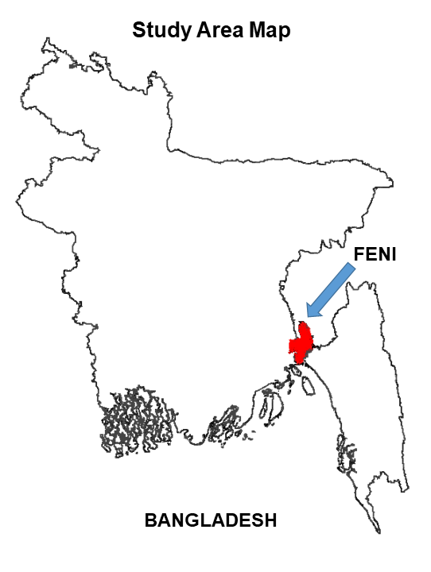
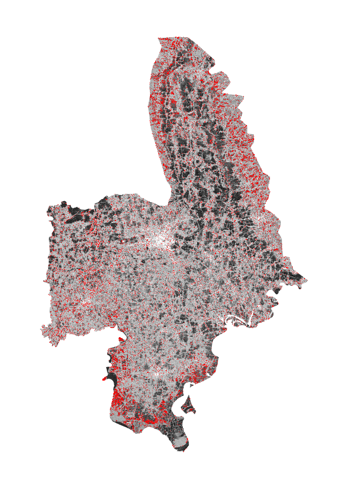
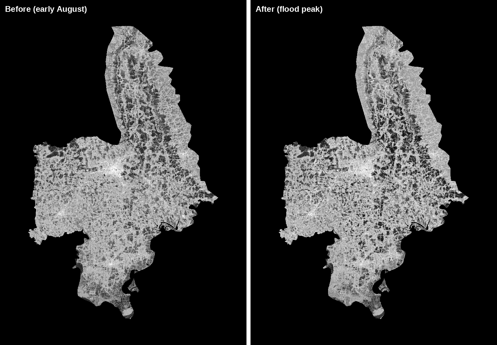
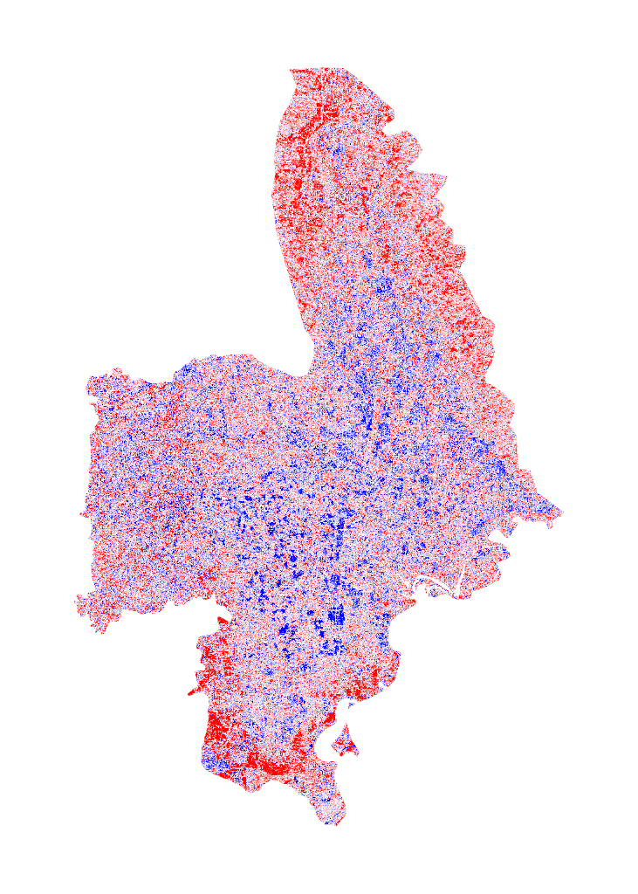

# Flood Extent Mapping of the Feni River Using Sentinel-1 Radar

A satellite remote-sensing project that maps the extent of the August 2024 flood in Feni District, Bangladesh, using Sentinel-1 radar imagery and change detection in Google Earth Engine. Radar is used because thick monsoon cloud made optical satellite imagery unusable during the flood.

## Study Area

Feni District sits in southeastern Bangladesh, near the border with India, and was one of the areas worst hit by the August 2024 floods.

## Why Radar

Optical satellites (the kind that take normal colour photos) cannot see through clouds, and the Feni flood happened under heavy monsoon cloud cover. Radar (Sentinel-1) sends its own signal and sees through clouds day or night, which makes it the right tool for mapping floods during active bad weather.

## How It Works

1. **Study area.** The Feni District boundary is pulled automatically from the FAO GAUL administrative dataset, so the area is exact and reproducible.
2. **Radar images.** Sentinel-1 VV radar images are collected for two periods: a "before" window in early August 2024 and an "after" window at the flood peak in late August. A median image is built for each period to reduce noise.
3. **Change detection.** The before image is subtracted from the after image. In this rural, crop-heavy floodplain, floodwater sitting among vegetation makes the radar signal brighter (a double-bounce effect), so areas that got brighter are flagged as possible flooding.
4. **Cleaning the result.** Three filters remove false positives:
   - a brightness threshold, so only clearly changed areas are kept,
   - a slope mask, since water does not pool on steep hillsides,
   - a permanent-water mask, so the existing river channel is not counted as new flooding.
5. **Area calculation.** The cleaned flood pixels are converted to real ground area in square kilometres.

## Results

Out of a district area of about 882 square kilometres, roughly **97 square kilometres (about 11% of the district)** were flagged as flooded.

The before and after radar images show the change directly. The flooded areas, especially along the northern river corridor, appear brighter in the "after" image.

## A Note on the Raw Change

Radar data is naturally speckly (grainy), so the raw before-and-after difference looks noisy before any cleaning. The image below shows this raw change (red is brighter, blue is darker). The scattered noise across the whole district is exactly why the slope, permanent-water, and brightness filters are needed to get a clean flood map.

## Honest Limitations

- The flooded area is an estimate. It was not checked against ground measurements or field reports, because reliable ground-truth data for this event was not available.
- The brightness threshold is set by hand. A different threshold would give a somewhat larger or smaller flooded area, so the 97 square kilometre figure is a reasonable estimate, not an exact number.
- Radar speckle adds noise. The filters reduce it but do not remove it completely.
- The method works best on open, flat, rural land. Flooding in dense urban areas can behave differently in radar and may be under-counted.

## How to Run

1. This project needs a free Google Earth Engine account and a project ID. In the first cell, replace the project ID with your own.
2. Open the notebook in Google Colab and run the cells in order.
3. The maps are interactive inside the notebook. The final cell saves them as static PNG images so they can be viewed anywhere.

## Tools

Python, Google Earth Engine, geemap, Sentinel-1 SAR, SRTM elevation data, Pillow (Google Colab)

## Acknowledgment

This project was completed with guidance from Claude (Anthropic) for code explanation, debugging support, and remote-sensing concepts during development. All analysis decisions and interpretation were done by the author, who can explain each step of the notebook.
