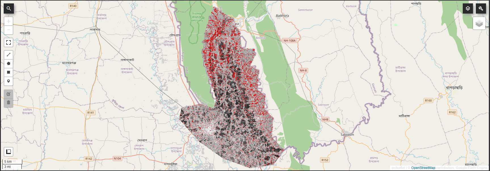

# Flood Mapping of the Feni River using Sentinel-1 Radar

A satellite-based flood mapping project detecting the extent of the August 2024 flood along the Feni river in Bangladesh, using Sentinel-1 radar and change detection in Google Earth Engine.

## Goal

Map how far floodwater spread along a stretch of the Feni river during the catastrophic flash flood of August 2024, and estimate the flooded area.

## Background

In August 2024, heavy rainfall and upstream inflow caused a severe flash flood across eastern Bangladesh. Feni was one of the worst hit districts, with inundation rising sharply compared to previous years. This project maps the flood extent for a focused stretch of the river near Parshuram, Fulgazi, and Belonia.

## Why Radar

The flood happened during the monsoon, so optical satellite images (such as Sentinel-2) were blocked by heavy cloud cover and unusable for the flood week. Sentinel-1 radar sees through clouds, day or night, which makes it the correct tool for flood mapping. Switching from optical to radar was the key decision that made the project possible.

## Method

1. Drew a custom study area as a polygon on the Bangladesh side of the border, focused on the river corridor (about 520 square km).
2. Pulled Sentinel-1 VV radar for two windows: before the flood (1 to 15 August 2024) and during the flood (22 to 31 August 2024).
3. Took the median of each window to reduce radar speckle noise.
4. Computed the change between the two periods (after minus before).
5. Flagged flooded pixels using a change threshold of 3 dB.

## A Note on the Radar Signal

Smooth open water appears dark in radar, but floodwater sitting among crops and vegetation appears brighter due to a double-bounce effect between the water surface and the vegetation. In this rural floodplain the flooding showed mainly as brightening, so a change-detection approach was used rather than simple dark-water detection. This was confirmed by inspecting the difference image, which showed mostly brightening in the flooded areas.

## Flood Map

Red marks detected flooding over the grayscale radar image. The study area sits on the Bangladesh side of the border, with flooding clustered along the river corridor and across the surrounding low-lying land.

## Results

| Metric | Value |
|--------|-------|
| Study area | 520.3 km2 |
| Detected flooded area | 82.1 km2 |
| Percent of study area flooded | 15.8% |

The flooding clusters along the river and across the floodplain, which is physically consistent with how floodwater spreads. The percent flooded is a more robust figure than the raw area, since the raw area depends on where the study boundary is drawn.

## Honest Limitations

- The flooded area depends on the 3 dB change threshold, so it is an estimate, not an exact measurement.
- Radar change detection flags flooding at the pixel level, so the result appears as distributed patches rather than one continuous sheet.
- No ground-truth data was used to validate the result, so the map shows likely flooding, not confirmed flooding.
- Because the study area is drawn by hand, the exact area figures shift slightly if the boundary is redrawn; the percent flooded is reported alongside the raw area for this reason.

## Tools

Google Earth Engine (Python API), Sentinel-1 GRD radar, geemap, Google Colab

## What This Project Demonstrates

- Choosing the right sensor for the problem (radar over optical for a cloudy flood)
- Diagnosing and adapting when the expected signal did not appear (flooding as brightening, not darkening)
- Change detection, area estimation, and honest reporting of method-dependent results

## Acknowledgment

This project was completed with guidance from Claude (Anthropic) for code explanation, debugging support, and technical concepts during development. All analysis decisions, data interpretation, and verification were conducted by the author.
